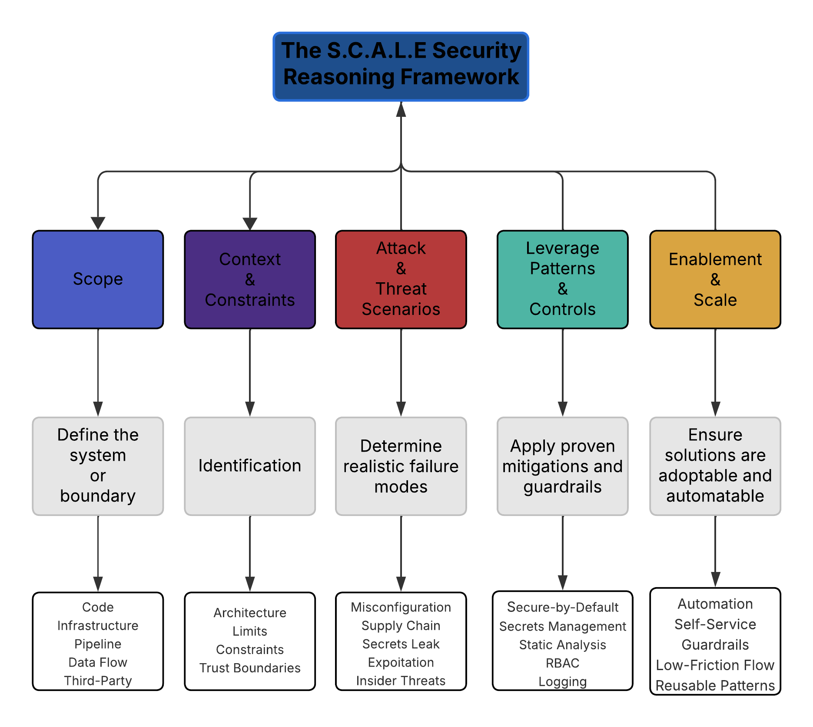

# SCALE-Framework
Official public reference for the SCALE Security Reasoning Framework (v1.0).
# SCALE Framework v1.0  
### A Practical, Scalable Mental Model for Security Decision-Making  
**Author:** John Stewart  
**Status:** Public Release  
**License:** CC BY-ND 4.0 (No Derivatives)

---

## 📘 Overview

The **SCALE Framework** is a five-step security reasoning model designed to help engineers, architects, and security leaders think clearly and systematically under pressure.

SCALE provides a lightweight but comprehensive structure for making real-time decisions across:

- Application Security  
- Cloud Security  
- Infrastructure Security  
- Secure SDLC  
- Architecture Reviews  
- Threat Modeling  
- Incident Response  
- DevSecOps / Platform Security  
- Supply Chain & Dependency Risk  

It exists to solve a persistent industry problem:  
**complex security decisions must often be made quickly, with incomplete information, while memory recall collapses under cognitive load.**

SCALE gives practitioners a reliable mental anchor to prevent “blank-out moments” and produce clear, defensible reasoning in any environment — including technical interviews.

---

## 🔐 The SCALE Framework (High-Level)

### **S → Scope**  
Define precisely what system, component, data flow, or boundary is under discussion.

### **C → Context & Constraints**  
Identify architectural patterns, trust boundaries, data classifications, regulatory pressures, ownership, and limitations.

### **A → Attack & Threat Scenarios**  
Enumerate realistic things that can go wrong: misconfigurations, exploits, supply chain issues, data exposure, insider misuse, and pipeline compromise.

### **L → Leverage Known Patterns & Controls**  
Map threats to proven mitigations using established security patterns, automation, tooling, guardrails, and secure-by-default templates.

### **E → Enablement & Scale-Friendly Implementation**  
Ensure the solution is developer-friendly, friction-minimized, automatable, self-service, and sustainable across teams.

---

## 📄 Full Whitepaper (v1.0)

**PDF:** *(Add the link to your uploaded PDF here once committed.)*

This whitepaper defines the full methodology, rationale, and application examples.

---

## 🎯 Purpose of SCALE

SCALE is designed to be:

- **Cognitively lightweight** — only 5 steps, always applicable  
- **Universally adaptable** — works for code, cloud, data, pipelines, infra  
- **Pressure-resistant** — built for real-time reasoning when memory fails  
- **Engineer-friendly** — aligns with practical, scalable solutions  
- **Easy to teach** — usable within minutes; masterable within a week  

SCALE is not a replacement for NIST, STRIDE, PASTA, or OCTAVE;  
it operates **above them**, providing an overarching reasoning structure.

---

## 🧠 When to Use SCALE

- Architecture review meetings  
- Threat modeling sessions  
- Cloud design discussions  
- CI/CD and platform security reviews  
- Interview problem-solving  
- Rapid risk assessments  
- Third-party integration evaluations  
- Emergency response / incident calls  

Any time you face an ambiguous security question, SCALE applies.

---

## 🛠 Example Application

**Scenario:** Reviewing a new microservice that updates user profiles.

**S – Scope:**  
REST microservice → updates user profile → writes to central user DB.

**C – Context:**  
Runs in Kubernetes, shared secrets, shared base image, no schema validation.

**A – Attacks:**  
Schema injection, token misuse, container escape from unpatched base image, secrets leakage, privilege escalation.

**L – Controls:**  
Schema validation, OPA/API gateway policy checks, hardened base image, automated scanning, per-service secrets, RBAC.

**E – Enablement:**  
Add validation library to templates, automate scanning, provide self-service secrets onboarding, standardized hardened base image.

---

## 📚 Future Extensions (Planned)

- Official diagrams and visual models  
- Architecture review checklists  
- Training curriculum and workshops  
- Companion book  
- SCALE v2.0 with expanded patterns  
- Potential certification pathway  

---

## 📜 License

This framework is licensed under the  
**Creative Commons Attribution-NoDerivatives 4.0 International License (CC BY-ND 4.0)**.

This means:

- You **may share** the framework non-commercially  
- You **must credit the author**  
- You **may NOT modify** the framework  
- You **may NOT commercialize** it  
- You may NOT create derivative frameworks  

This protects the integrity of SCALE while allowing industry adoption.

**Full license text:** See `LICENSE.txt` in this repository.

---

## 🏷 Trademark Notice

The SCALE Framework name and branding may be trademarked in future versions.  
This repository constitutes the official public reference for version 1.0.

---

## 👤 About the Author

**John Stewart** is an application and cloud security architect with over 20 years of experience designing, building, and leading secure software programs across enterprises and critical infrastructure organizations. He specializes in pragmatic, scalable AppSec strategy, secure SDLC design, developer enablement, and cloud security architecture.

---

## ⭐ Support the Framework

If you find SCALE useful, please star the repository and share it with peers.  
Your support helps establish SCALE as a recognized industry standard.
